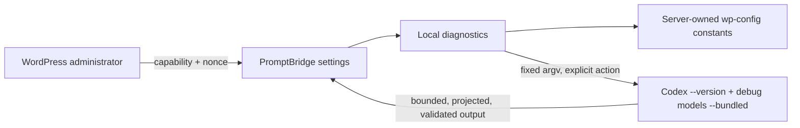
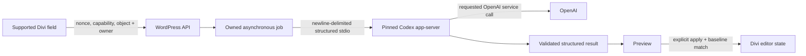

# Architecture

## Implemented staging-alpha boundary

The current plugin has no public REST endpoint, job queue, authentication flow,
Divi editor extension, generation request, or runtime downloader. **Run
diagnostics** is the only model-catalog refresh trigger; there is no background
cron launch.

The model catalog response is capped at 2 MB. PromptBridge stores only a strict
projection of list-visible API models in the non-autoloaded
`mdw_pbd_model_catalog` option, preserves the last-good cache on refresh
failure, and never stores the raw catalog.

## Planned text-generation boundary

This path is proposed, not implemented. `codex app-server` is experimental.
Implementation requires a pinned version, generated schemas, fixed arguments,
dedicated `CODEX_HOME`, minimum tools/permissions, and live failure tests.

## Ownership

| Resource                    | Owner                          | Current state                                           |
| --------------------------- | ------------------------------ | ------------------------------------------------------- |
| Plugin source and options   | WordPress plugin               | Implemented                                             |
| Codex executable            | Server owner                   | Read-only diagnostics only                              |
| Dedicated Codex home        | Server owner/plugin deployment | Path check only                                         |
| Model catalog               | WordPress plugin               | 288-byte non-autoloaded cache; list-visible models only |
| ChatGPT account and tokens  | Codex                          | Not initialized by plugin                               |
| Divi module state           | Divi editor                    | Not touched                                             |
| Generated WordPress content | WordPress author/editor        | Not created                                             |

## Shared contracts before M2

- PHP accepts only version-matched generated protocol messages.
- Jobs bind owner, target, baseline digest, status, timeout, and result.
- Browser callers cannot choose executable paths, process arguments, tools, or
  filesystem scopes.
- Apply requires current object authorization and the original baseline digest.
- Unknown event types fail closed and preserve an auditable uncertain state.
