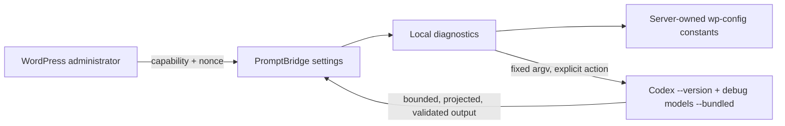
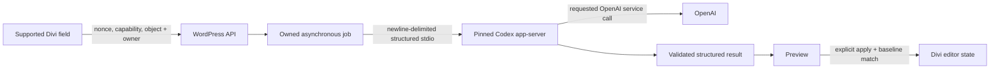

# Architecture

## Implemented staging-alpha boundary

```mermaid
flowchart LR
    A[WordPress administrator] -->|capability + nonce| B[PromptBridge settings]
    B --> C[Local diagnostics]
    C --> D[Server-owned wp-config constants]
    C -->|fixed argv, explicit action| E[Codex --version + debug models --bundled]
    E -->|bounded, projected, validated output| B
```

The plugin has an owner-checked REST job queue and a Divi Text Body field
action. The browser request queues work and polls status; WordPress Cron starts
the bounded Codex process. PromptBridge does not implement Codex sign-in,
cancel, or a runtime downloader. **Run diagnostics** remains the only
model-catalog refresh trigger.

The model catalog response is capped at 2 MB. PromptBridge stores only a strict
projection of list-visible API models in the non-autoloaded
`mdw_pbd_model_catalog` option, preserves the last-good cache on refresh
failure, and never stores the raw catalog.

## Staging text-generation boundary

```mermaid
flowchart LR
    A[Supported Divi field] -->|nonce, capability, object + owner| B[WordPress API]
    B --> C[Owned asynchronous job]
    C -->|newline-delimited structured stdio| D[Pinned Codex app-server]
    D -->|requested OpenAI service call| E[OpenAI]
    D --> F[Validated structured result]
    F --> G[Preview]
    G -->|explicit apply + baseline match| H[Divi editor state]
```

The job and Divi field flow are implemented for staging. The PHP client uses
fixed JSONL messages, a dedicated `CODEX_HOME`, read-only permissions, bounded
input/output, and a timeout. The App Server is experimental, the protocol is not
pinned in this release, and the client does not use generated schemas. Treat its
test fixture as parser coverage, not upstream compatibility proof. Live account,
Divi Undo/Save, and target cPanel checks remain open.

## Ownership

| Resource                    | Owner                          | Current state                                           |
| --------------------------- | ------------------------------ | ------------------------------------------------------- |
| Plugin source and options   | WordPress plugin               | Implemented                                             |
| Codex executable            | Server owner                   | Fixed-argument local App Server request                 |
| Dedicated Codex home        | Server owner/plugin deployment | Validated private home; Codex sign-in is owner-managed  |
| Model catalog               | WordPress plugin               | 288-byte non-autoloaded cache; list-visible models only |
| ChatGPT account and tokens  | Codex                          | Not exposed to WordPress; sign-in not managed by plugin |
| Divi module state           | Divi editor                    | Text Body changes only after preview Apply              |
| Generated WordPress content | WordPress author/editor        | Private job result until explicit Apply                 |

## Remaining gates

- Protocol pinning and version-matched generated schemas remain future work.
- Jobs bind owner, target, baseline digest, status, timeout, and result.
- Browser callers cannot choose executable paths, process arguments, tools, or
  filesystem scopes.
- Apply requires current object authorization and the original baseline digest.
- Unknown or malformed messages fail closed with a generic job error.
- WordPress Cron and cPanel CLI scheduling need a live host test.
