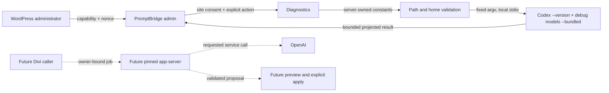

# PromptBridge for Divi Threat Model

## 1. Overview

This reusable model covers the repository-wide staging alpha. Implemented code
provides safe WordPress activation, a capability-protected administrator page,
explicit service consent, local diagnostics, canonical runtime-path checks,
bounded fixed-argument version and model-catalog probes, strict catalog
projection/cache handling, cleanup, packaging, static docs, and GitHub
automation. Authentication, persistent jobs, generation, Divi editing, and image
import are planned boundaries, not current attack paths.

| Component         | Role                                                                          | Evidence                                                                      |
| ----------------- | ----------------------------------------------------------------------------- | ----------------------------------------------------------------------------- |
| Plugin bootstrap  | Loads local M1 classes and lifecycle hooks                                    | `apps/plugin/promptbridge-for-divi.php`                                       |
| Admin page        | Capability, nonce, disclosure, consent, diagnostics                           | `apps/plugin/includes/class-admin-page.php:35`                                |
| Diagnostics       | Checks local prerequisites and enforces probe gates                           | `apps/plugin/includes/class-diagnostics.php:20`                               |
| Runtime boundary  | Canonical executable/home validation plus fixed argv, timeout, bounded output | `class-runtime-path.php`, `class-runtime-home.php`, `class-runtime-probe.php` |
| Uninstall         | Removes fixed plugin-owned WordPress state                                    | `apps/plugin/uninstall.php:10`                                                |
| GitHub automation | CI, Pages, releases, dependency updates, gated SVN deployment                 | `.github/workflows`, `.github/dependabot.yml`                                 |
| Planned M2/M3     | Owner-bound jobs, Codex protocol, preview/apply, images                       | `docs/ARCHITECTURE.md:18`                                                     |



### Effective resources

| Deployment or workflow | Resource or capability                              | Configuration and precedence                                                                          | Safe effective value or location   | Readers, writers, or recipients                                    | Enforcing control                                                                           | Evidence or unknowns                                                         |
| ---------------------- | --------------------------------------------------- | ----------------------------------------------------------------------------------------------------- | ---------------------------------- | ------------------------------------------------------------------ | ------------------------------------------------------------------------------------------- | ---------------------------------------------------------------------------- |
| WordPress M1           | Administrator access                                | Activation grants `mdw_pbd_manage` to the administrator role                                          | WordPress capability record        | Admin page and consent action                                      | Capability at menu and render                                                               | `class-plugin.php:16,48`; `class-admin-page.php:39,65`                       |
| WordPress M1           | Service consent                                     | Non-autoloaded `mdw_pbd_settings`; capable nonce-protected POST                                       | One site-level boolean             | Diagnostics probe gate                                             | Capability, nonce, strict boolean                                                           | `class-admin-page.php:74-81`; not future account ownership                   |
| cPanel/local host      | Codex executable                                    | `MDW_PBD_CODEX_PATH` in `wp-config.php`, then `realpath`                                              | Canonical regular executable       | PHP worker and selected binary                                     | Absolute path, executable check, fixed argv                                                 | No signature or compatibility manifest yet                                   |
| cPanel/local host      | Codex home                                          | `MDW_PBD_CODEX_HOME`, canonical directory, marker, permissions, outside `ABSPATH`                     | Reserved private directory         | PHP worker and Codex                                               | Server constant, empty regular marker, exact mode `0700`                                    | Same-OS-user isolation still needs host evidence                             |
| Explicit diagnostics   | Child process                                       | Fixed `[executable, "--version"]` and `[executable, "debug", "models", "--bundled"]`, explicit action | Local process only                 | Authorized admin receives safe diagnostics and a projected catalog | Consent, no shell, 2 MB response cap, strict projection, timeout, escaping, last-good cache | No background cron launch; descendant process-group handling needs M2 design |
| Model catalog cache    | Non-autoloaded WordPress option                     | `mdw_pbd_model_catalog`; list-visible API models only                                                 | Small projected cache              | Authorized admin/model selector                                    | Strict validation, 2 MB cap, last-good preservation                                         | Raw 443 KB catalog is never stored                                           |
| GitHub CI              | Checks and ZIP                                      | Repository workflows and lockfiles                                                                    | Ephemeral runner and versioned ZIP | Maintainers and Actions artifact readers                           | Read-only defaults, pinned action SHAs                                                      | GitHub-hosted controls remain external prerequisites                         |
| GitHub Pages           | Static docs                                         | `main` plus Pages environment                                                                         | `apps/docs/out`                    | Public docs readers                                                | Pages/id-token permissions only                                                             | Requires Pages source configuration                                          |
| WordPress.org deploy   | SVN publication                                     | Manual dispatch, exact confirmation/version/tag, dry-run default, environment hook                    | Plugin SVN trunk and immutable tag | WordPress.org                                                      | Tests; secrets enter only the commit step                                                   | Slug and required-reviewer configuration are absent; do not run yet          |
| Future M2/M3           | Account, jobs, prompts, Divi state, results, images | Not implemented                                                                                       | No effective value                 | No current consumer                                                | No current route                                                                            | Exact controls remain release gates                                          |

## 2. Threat Model, Trust Boundaries, and Assumptions

### Protected assets and objectives

- WordPress authorization, settings integrity, and site availability.
- Server process authority and the configured executable identity.
- Future ChatGPT identity, tokens, allowance, prompts, and results.
- Divi module identity, unsaved state, responsive/rich-text values, baseline,
  preview/apply intent, undo, and persisted content integrity.
- Future job ownership, cancellation, deadlines, and uncertain-completion state.
- Plugin release, WordPress.org SVN, GitHub environments, and artifact
  integrity.

### Actors and starting capabilities

- An unauthenticated visitor can send normal WordPress requests but has no
  PromptBridge route in M1.
- A logged-in user without `mdw_pbd_manage` cannot open or submit the page.
- Any user with `mdw_pbd_manage` can set site-level consent and run diagnostics;
  this does not establish ownership of a future connected Codex account.
- The server owner can configure paths and already has substantial host power.
- Code running as the PHP OS user may share access to a writable Codex home;
  separation from `ABSPATH` is not OS isolation.
- Repository contributors and compromised dependencies may affect build output,
  subject to review, lockfiles, pinned actions, and environment controls.
- GitHub environment names do not enforce approval by themselves. Required
  reviewers must be configured before pushing a release tag or enabling SVN
  publication.

### Trust boundaries and invariants

- Browser to WordPress: capability and nonce checks remain separate.
- `wp-config.php` to process: browser data never selects the executable or argv.
- PHP to Codex: use a pinned release, generated schema, minimum permissions,
  structured stdio, output/deadline limits, and no public listener.
- Codex to OpenAI: no request without informed opt-in and an explicit user
  action.
- Future result to Divi: validate, render safely, recheck authorization and the
  exact baseline, then require explicit Apply through documented editor state.
- GitHub to publication: least privilege, immutable reviewed source, protected
  environments, exact version binding, and no credentials in artifacts.
- Uninstall to filesystem/data: delete only records and paths with verifiable
  plugin ownership; preserve Codex, external credentials, pages, and media.

### Assumptions, exclusions, and unknowns

- `codex app-server` is documented but experimental; production support is not
  assumed.
- Exact schemas, authentication lifecycle, service destinations, tool sandbox,
  rate-limit fields, and image artifacts require a pinned-release live test.
- Divi label-button extension does not prove takeover of its built-in AI action.
- cPanel process, filesystem, worker, and cron behavior is unknown.
- WordPress.org eligibility, trademark position, and slug approval are unknown.
- Multisite and generated executable-code insertion are excluded.
- This model maps architecture and hypotheses; it is not a vulnerability report.

## 3. Attack Surface, Mitigations, and Attacker Stories

Every row below is a hypothesis unless later validation records a finding.

| Priority | Scenario and capability gain                                               | Prerequisites                                               | Impact                                              | Existing controls                                                                                      | Mitigation                                                                                               | Evidence                                                       |
| -------- | -------------------------------------------------------------------------- | ----------------------------------------------------------- | --------------------------------------------------- | ------------------------------------------------------------------------------------------------------ | -------------------------------------------------------------------------------------------------------- | -------------------------------------------------------------- |
| P1       | Replace configured Codex binary and gain PHP-worker execution              | Host or same-user write access to binary/path               | Site files, private runtime state, outbound access  | Server-only constant, canonical path, fixed argv                                                       | Pin compatible version; verify owner/mode and deployment integrity before M2                             | `class-runtime-path.php:22`; no browser reachability           |
| P1       | Reuse site consent as account ownership                                    | Future auth/jobs rely only on current site boolean          | One admin consumes another owner's account/data     | M1 has no account or job path                                                                          | Bind auth, jobs, cancellation, and results to connected WordPress owner                                  | `class-plugin.php:64`; planned boundary only                   |
| P1       | Prompt/page injection expands Codex tools or filesystem authority          | Future client exposes tools or follows content instructions | File/network/process access beyond generation       | No generation client exists                                                                            | Pin schema; disable dynamic installs/hooks/shell; explicit allowlist and sandbox                         | `docs/research/CODEX-PROTOCOL.md`                              |
| P1       | Stale proposal overwrites newer Divi edits                                 | Future async generation plus changed baseline               | Lost editor work or wrong module update             | No apply path exists                                                                                   | Bind site/module/field/value mode and baseline digest; reject mismatch                                   | `docs/ARCHITECTURE.md:48-52`                                   |
| P1       | Duplicate/uncertain job completion applies twice or spends allowance twice | Future queue, crash, retry                                  | Duplicate content, cost, confusing state            | No queue exists                                                                                        | Atomic owner claim, idempotency key, heartbeat, deadline, no blind retry                                 | Project brief M2 requirement                                   |
| P1       | Untrusted image path/URL reaches filesystem or media importer              | Image output becomes supported                              | SSRF, path traversal, malicious file, storage abuse | No image importer exists                                                                               | Accept only verified local owned artifacts; signature/MIME/size/dimension checks                         | Image gate remains blocked                                     |
| P2       | Shared OS user reads future Codex credentials                              | Weak host ownership or shared home                          | Account/token compromise                            | Outside web root, empty marker, exact mode `0700`                                                      | Verify UID/ACL and per-owner directory; document host prerequisite                                       | `apps/plugin/includes/class-runtime-home.php`                  |
| P2       | Child floods output or hangs descendants                                   | Malicious/misconfigured executable                          | PHP memory/worker exhaustion                        | Nonblocking loop, per-read/retained-byte caps, timeout, terminate/kill                                 | Add process-group lifecycle and total-work budget for app-server                                         | `class-runtime-probe.php`; tests cover read budget and timeout |
| P2       | CI publication uses unreviewed ref or stolen secret                        | Maintainer/supply-chain compromise                          | Malicious ZIP, docs, or SVN release                 | Pinned action SHAs, least permissions, version checks, environment hooks, commit-step-only SVN secrets | Configure required reviewers; require signed/tag policy; attest checksum; keep SVN manual until approval | `.github/workflows/release.yml`, `deploy-wordpress-org.yml`    |
| P3       | Uninstall deletes unrelated data                                           | Future cleanup accepts arbitrary path                       | Data loss                                           | Fixed identifiers; no recursive deletion                                                               | Ownership ledger and boundary/symlink checks before new persistence                                      | `apps/plugin/uninstall.php:10-24`                              |

## 4. Severity Calibration (Critical, High, Medium, Low)

| Level    | PromptBridge example                                                                                                                                                                      | Counterexample or lowering control                                                                                                                           |
| -------- | ----------------------------------------------------------------------------------------------------------------------------------------------------------------------------------------- | ------------------------------------------------------------------------------------------------------------------------------------------------------------ |
| Critical | Unauthenticated internet caller reaches a process/tool path and gains server-wide code execution or mass credential access                                                                | A malicious binary requiring prior `wp-config.php` and filesystem control is not automatically Critical because attacker authority already includes the host |
| High     | Cross-owner Codex token use; authorized low-privilege user escapes to PHP-worker filesystem/process authority; stale apply causes broad destructive content changes                       | No M1 public route, account, generation client, or apply sink exists                                                                                         |
| Medium   | Same-site authorized user reads another owner's prompt/result; bounded but repeatable worker exhaustion; release workflow can publish an unreviewed artifact with realistic prerequisites | Configured environment reviews, exact version binding, byte/deadline limits, and owner checks lower reachability or impact                                   |
| Low      | Escaped diagnostic detail, minor metadata exposure, or cleanup residue without credentials/content loss                                                                                   | Exact path redaction and escaped one-line output reject the current diagnostic hypothesis                                                                    |

Missing evidence changes confidence, not impact. A planned story is not a
finding until the entry point, control failure, and consequence are reachable in
implemented code.

```text
Repository: sha256:d8f284738d34fcb2e5fa7fee71855f5918470129d65df1f749f4d07c24579cb4
Version: codex-security-snapshot/v1:sha256:c3adb22a13e7ae6bfface72cadb62a1fb84815c34cf99e162404c24cdb892e9c
```
